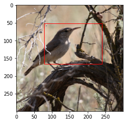
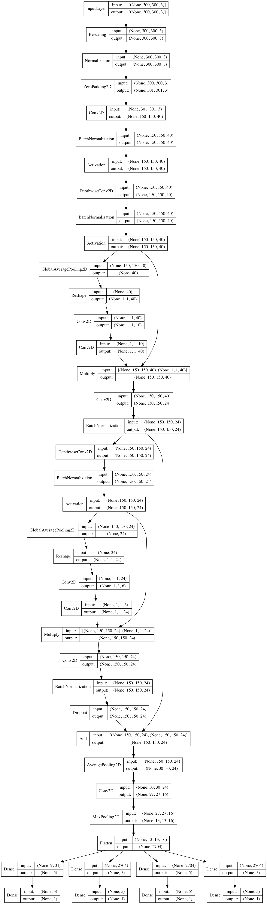

# Object detection with Transfer Learning

  

A branching neural network is built using the top layers and
two residual blocks from EfficientNetB3, which are trained on ImageNet
and frozen while fitting the model.

## Model

## Data

This model is trained using the images of birds and their accompanying bounding boxes
(coordinates for the bounds of a region for a given image).

[Link](http://www.vision.caltech.edu/visipedia/papers/WelinderEtal10_CUB-200.pdf)
to the pdf for the paper this data originates from

###### Citations

    @techreport{WelinderEtal2010,
        Author = {P. Welinder and S. Branson and T. Mita and C. Wah and F. Schroff and S. Belongie and P. Perona},
        Institution = {California Institute of Technology},
        Number = {CNS-TR-2010-001},
        Title = {{Caltech-UCSD Birds 200}},
        Year = {2010}
    }